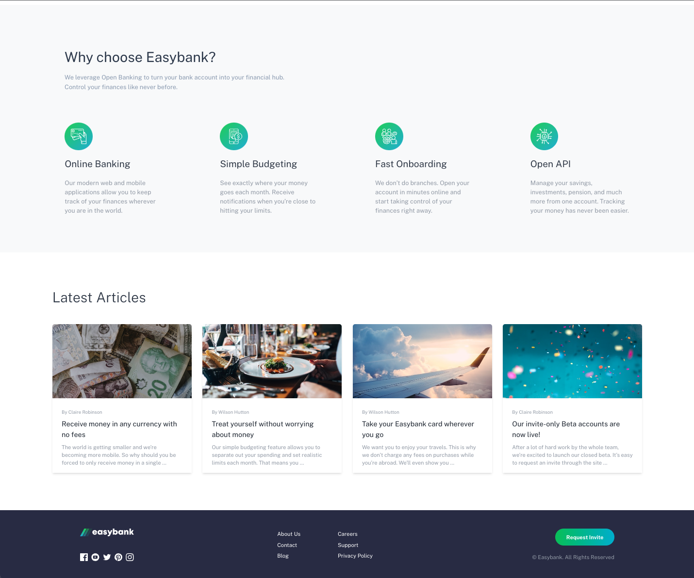

# Easybank Landing Page

## Design Mockup


## Screenshots




## Overview

This is my attempt at a coding challenge from Frontend Mentor. The goal of this challenge was to recreate a landing page based on the provided JPEG design files.

## Live Demo

## Technology


## Install

To clone and run this application, you'll need [Git](https://git-scm.com) and [Node.js](https://nodejs.org/en/download/) (which comes with [npm](http://npmjs.com)) installed on your computer. From your command line:

```bash
# Clone this repository
$ git clone https://github.com/trdotpy/react-easybank-landing

# Go into the repository
$ cd react-easybank-landing

# Install dependencies
$ npm install

# Run the app
$ npm run dev
```

## Contact

[](https://github.com/trdotpy/)
[](mailto:tanvi.rahman@outlook.com)
